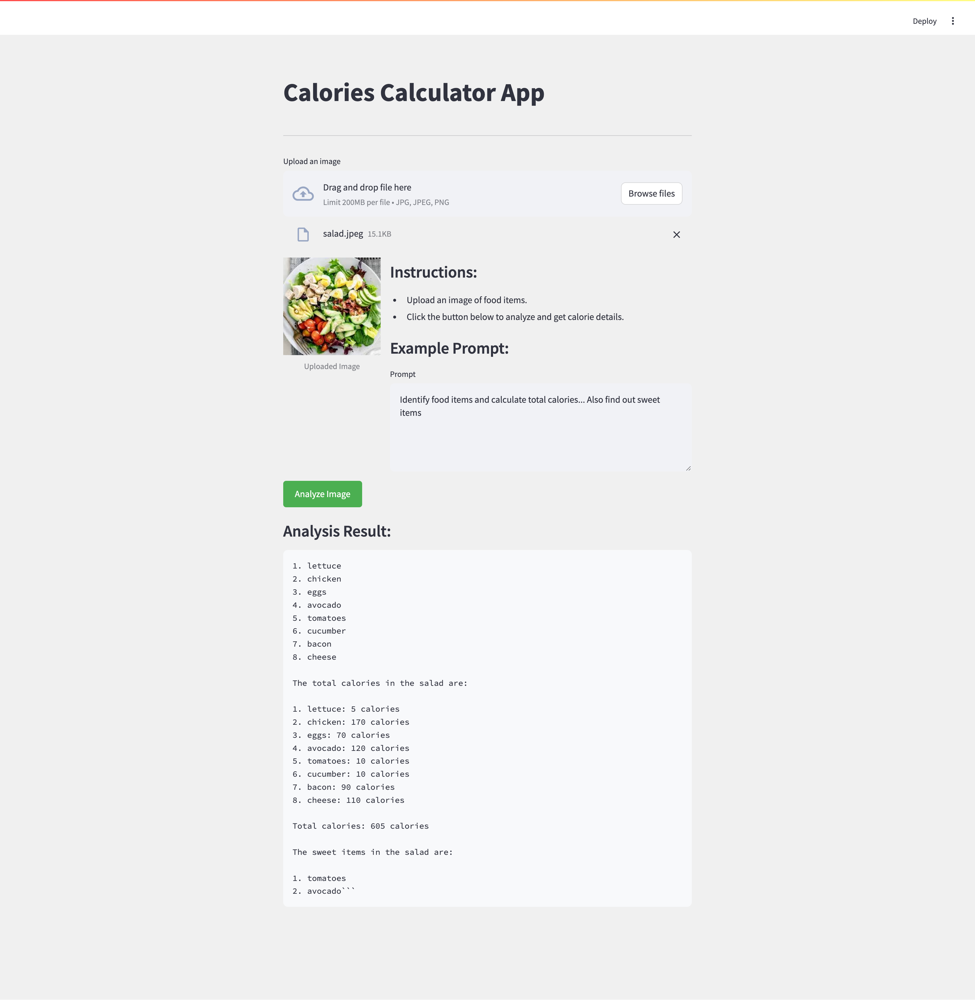

# Calories Calculator App



## Overview

The Calories Calculator App is a streamlined tool powered by Google Generative AI (Gemini Pro Vision API) designed to analyze images of food items and provide detailed calorie information. It allows users to upload images directly, input a prompt for the AI model, and receive a comprehensive analysis of food items detected in the image along with their calorie counts.

## Features

- **Image Upload:** Users can upload JPEG, JPG, or PNG images containing food items for analysis.
- **Prompt Input:** Input a prompt specifying the details required from the AI model.
- **AI Analysis:** Utilizes Google Generative AI to identify food items and calculate their total calories based on the image and input prompt.
- **Interactive Interface:** Simple and intuitive UI designed using Streamlit, with clear instructions and feedback messages.

## Getting Started

### Prerequisites

Ensure you have Python 3.x installed along with the necessary dependencies listed in `requirements.txt`.

### Installation

1. Clone the repository:
   ```bash
   git clone https://github.com/your-username/calories-calculator-app.git
   cd calories-calculator-app
   ```

2. Install dependencies:
   ```bash
   pip install -r requirements.txt
   ```

### Usage

1. Run the app locally:
   ```bash
   streamlit run app.py
   ```

2. Open your web browser and go to `http://localhost:8501` (or as indicated by Streamlit).

3. Upload an image of food items and input a prompt in the provided text area.

4. Click on the "Analyze Image" button to see the AI-generated analysis including calorie details.

### Example Prompt

```
Identify food items and calculate total calories...
1. Food Item 1 - calories
2. Food Item 2 - calories
---
---
```

## Customization

You can customize the app further by modifying the CSS styles in `app.py` to match your branding or UI preferences.

## Contributing

Contributions are welcome! Please fork the repository and create a pull request with your improvements.

## License

This project is licensed under the MIT License - see the LICENSE file for details.

## Acknowledgments

- Built using Streamlit and Google Generative AI.
- Special thanks to the contributors and open-source community for their valuable tools and libraries.

---

**Note:** This app is developed for educational and demonstration purposes. It uses Google Generative AI, and you will need appropriate API access and credentials to fully utilize its capabilities.

